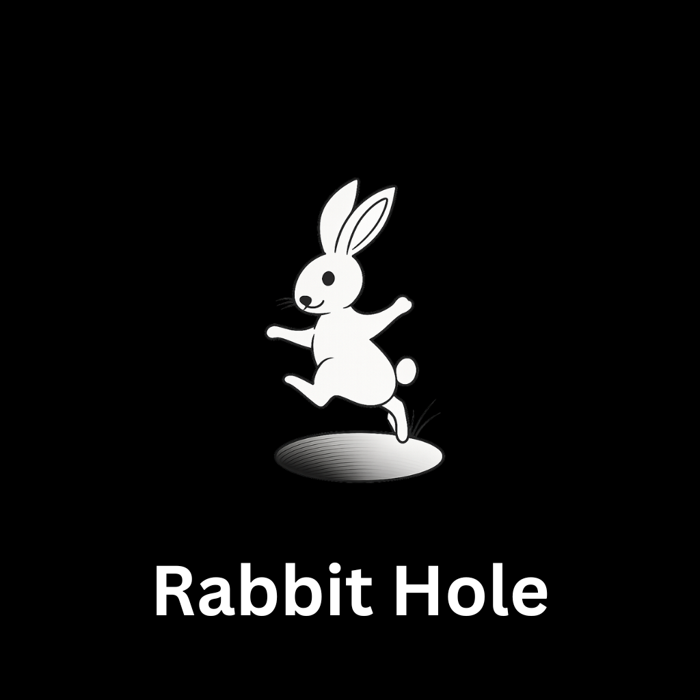
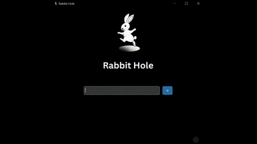
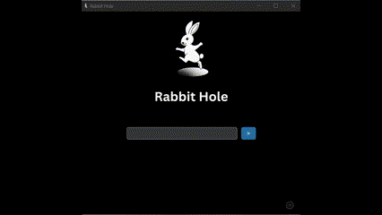
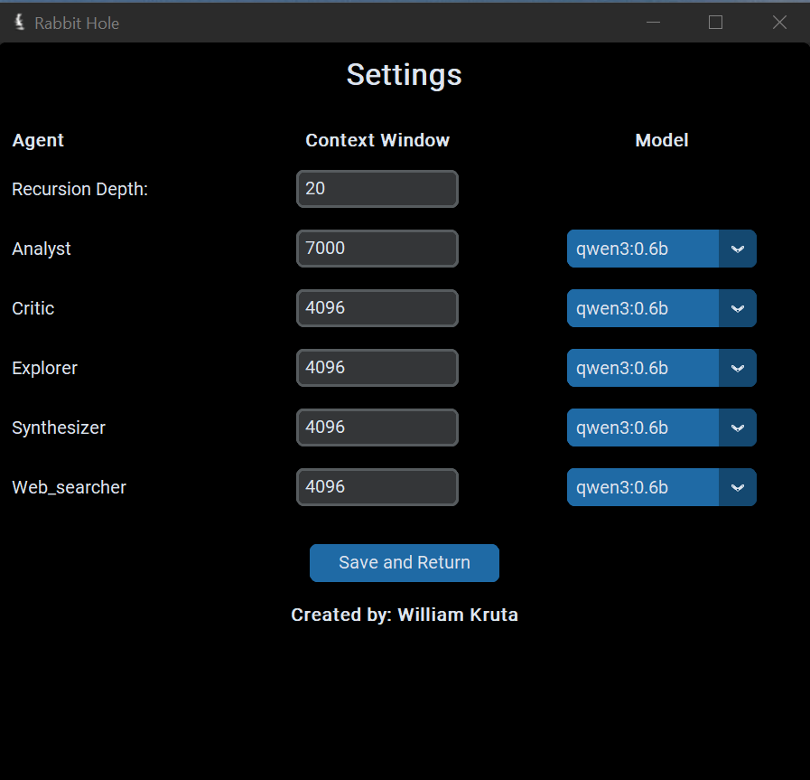

# Rabbit Hole

`Rabbit Hole` is a `deep research` frame work. It's designed to help you generate a comprehensive and detailed report on any given topic.

# Getting Started

**1**. Install `Ollama` on your system to run locall llms. You can find the installation [here](https://ollama.com/)

**2**. Download Language Models to your system. You can find them [here](https://ollama.com/search)

**3**. Clone the repository `git clone https://github.com/William-Kruta/RabbitHole.git`

**4**. Install dependencies using pip: `pip install -r requirements.txt`

**5**. Run the program with `python gui.py`

What is the best IPO to invest in?

### Research

When researching a topic, you will be aided by 4 agents.

Analyst: This agent analyzes the topic and provides a detailed analysis. It compiles web data to provide more context to its analysis.
Critic: This agent will critically evaluate the analyst's analysis and provide feedback on it, and weak points where more data can be collected.
Synthesizer: This agent will generate a synthesis of the analysis and the criticisms of it.
Explorer: This agent will explore new topics based on the findings. It will weigh the analysis, and the criticisms to determine what to explore next.

The research flow is as follows:

`Web Data -> Analyst -> Critic -> Synthesizer -> Explorer -> Web Data -> Repeat`

###### Below are some examples

**_Note_**: Clips were sped up to fit in gif format.

### Settings

Configure your research parameters in the settings page. You have full control over which model to use for each agent. You can also change the context window size, which determines how much information the model can process during research.

